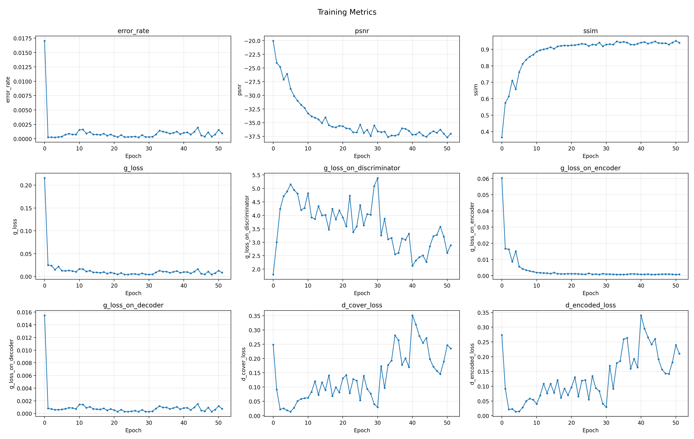
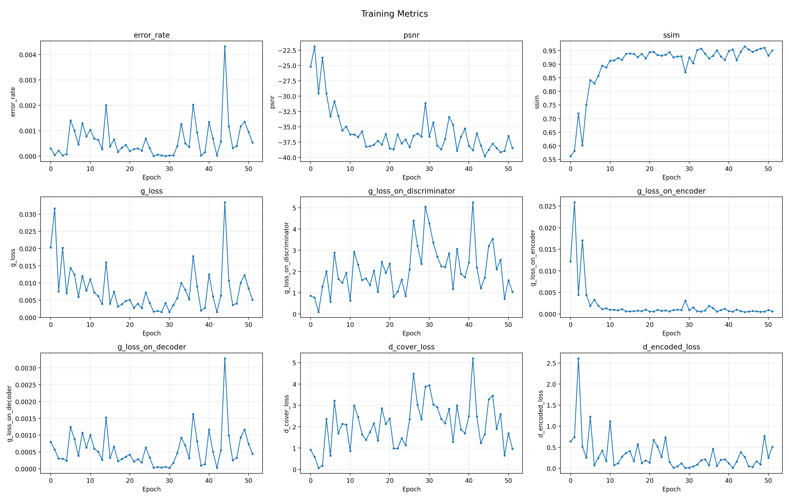
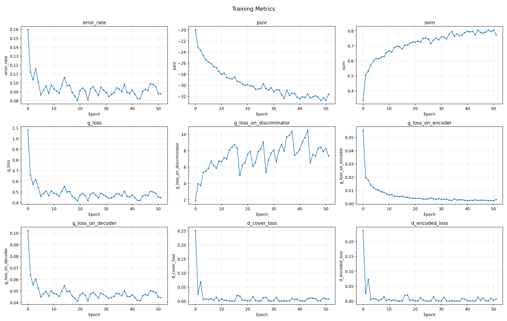
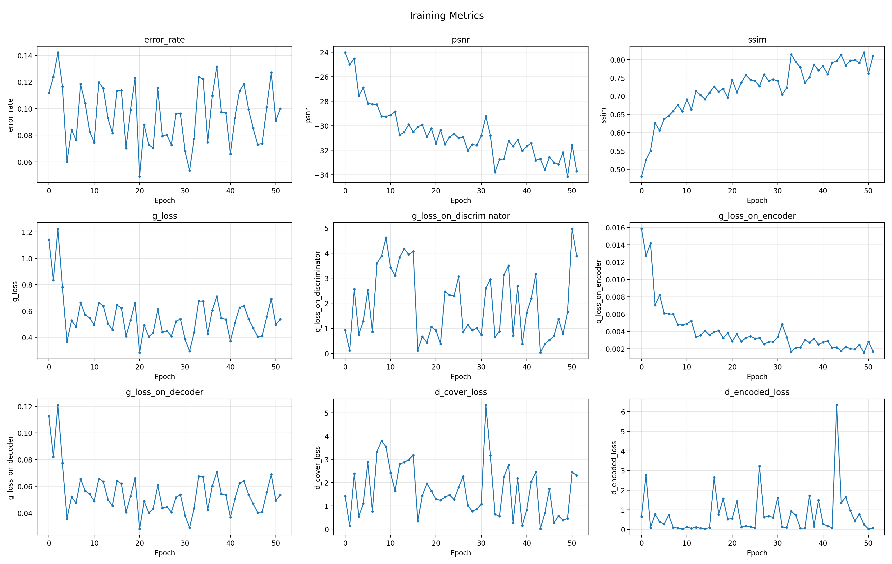
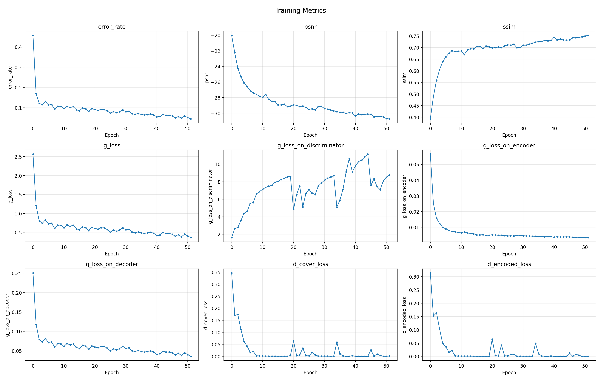
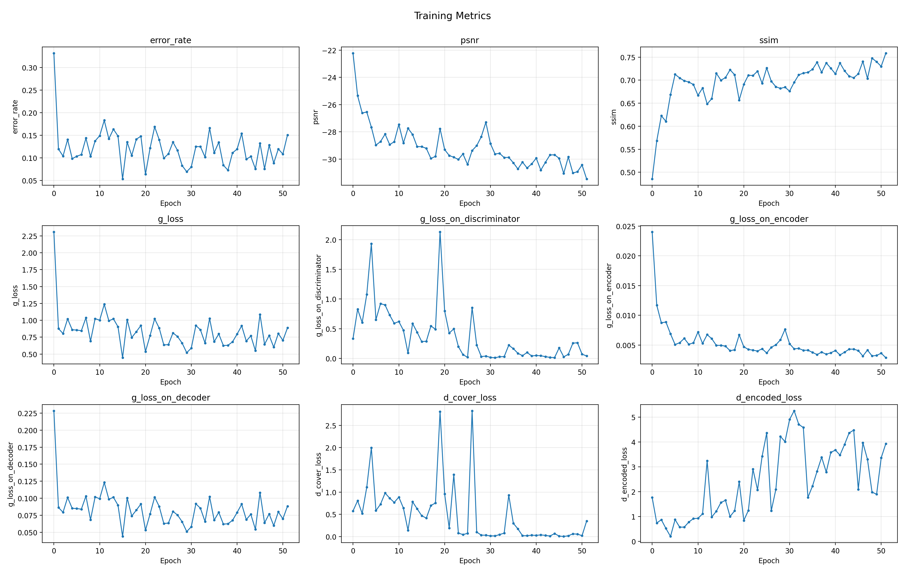
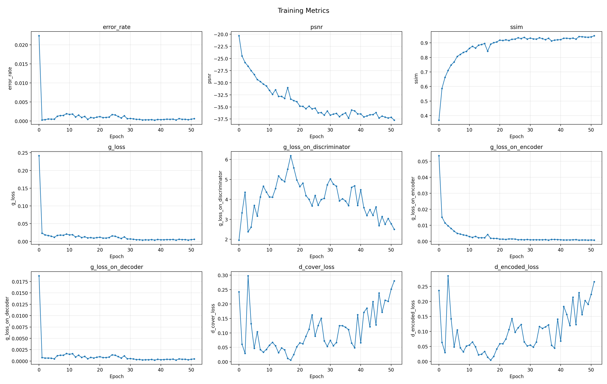
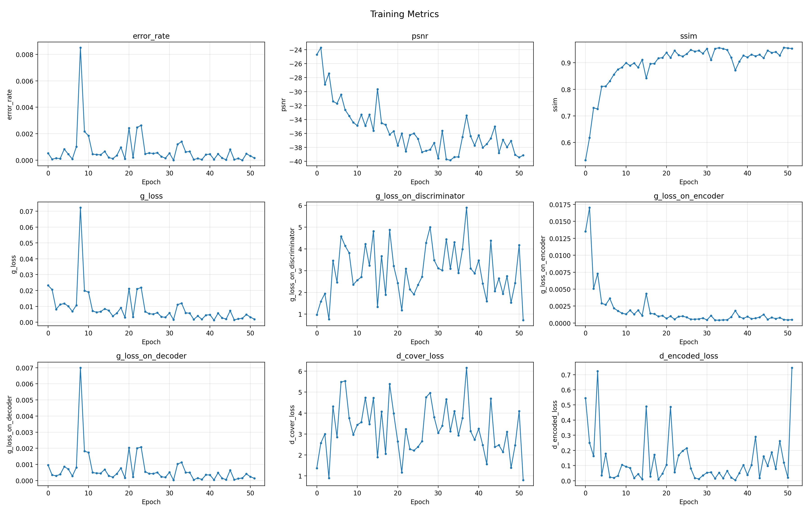

# 基于编码-解码器架构的鲁棒图像数字水印算法实验报告

**姓名**：王峰

**学号**：PB24000314

**日期**：2026 年 4 月 29 日

---

## 目录

1. [实验一：源代码验证](#实验一源代码验证)
2. [实验二：裁剪攻击与扩散块测试](#实验二裁剪攻击与扩散块测试)
3. [实验三：通道注意力的改进](#实验三通道注意力的改进)
4. [思考题](#思考题)

---

## 实验一：源代码验证

### 1.1 实验目的

1. 上手使用超算平台并熟悉 MBRS 项目源代码
2. 验证基于编码-解码器架构的数字水印系统能否正常训练与测试
3. 观察 baseline 模型在 JPEG 压缩攻击下的鲁棒性

### 1.2 实验配置

| 参数 | 值 |
|---|---|
| 图像尺寸 (H × W) | 128 × 128 |
| 消息长度 (message_length) | 64 bits |
| Batch Size | 32 |
| 学习率 | 0.001 |
| 训练轮数 | 52 epochs |
| 扩散块 (with_diffusion) | False |
| 自注意力 (with_self_attention) | False |
| 噪声层 | Combined([JpegMask(50), Jpeg(50), Identity()]) |
| 数据集 | ImageNet ILSVRC 2016 (训练), COCO 2014 Val (验证/测试) |

### 1.3 训练过程

实验一的训练分为两个阶段完成：

- **第一阶段**（Epoch 0–36, 37 轮）：模型从头开始训练，噪声层在真实 JPEG、模拟 JPEG（JpegMask）和恒等映射（Identity）之间随机切换。
- **第二阶段**（Epoch 37–51, 15 轮）：加载第一阶段 Epoch 36 的模型权重继续训练。

合并后共 52 轮完整训练。训练过程中的各项指标变化曲线如图 1.1 和图 1.2 所示。

*图 1.1: 实验一训练集指标曲线*

*图 1.2: 实验一验证集指标曲线*

从训练曲线可以观察到：
- **误码率（error_rate）**：在训练初期（Epoch 0–5）快速下降，从约 1.7% 降至 0.04% 左右，之后在 0.02%~0.16% 之间波动，整体呈下降趋势。
- **PSNR**：从初始的约 20 dB 持续提升至约 37 dB，说明编码器生成的含水印图像质量不断提高。
- **SSIM**：从约 0.36 稳步上升至约 0.94，表明含水印图像与原图的结构相似度逐步增强。
- **生成器损失（g_loss）**：初期下降迅速，后期稳定在较低水平。
- **判别器损失（d_cover_loss, d_encoded_loss）**：呈现 GAN 训练典型的对抗波动特征。

### 1.4 测试结果

使用训练完成的模型（Epoch 50 权重），在 COCO 2014 测试集（1000 张图片）上进行测试，噪声层为 `Combined([JpegMask(50)])`，强度因子 strength_factor = 1。

| 指标 | 数值 | 达标要求 | 是否达标 |
|---|---|---|---|
| **BER (误码率)** | 0.00625% | ≤ 0.8% | ✅ |
| **PSNR** | 38.66 dB | ≥ 32 dB | ✅ |
| **SSIM** | 0.9508 | ≥ 0.85 | ✅ |

### 1.5 小结

实验一成功完成了 MBRS 基础模型的训练与测试。三项核心指标均优于评分标准，说明该编码-解码器架构配合 MBRS 的混合噪声层策略能够有效抵抗 JPEG 压缩攻击，同时保持良好的图像视觉质量。

---

## 实验二：裁剪攻击与扩散块测试

### 2.1 实验目的

1. 通过引入裁剪攻击（Crop Attack），理解卷积神经网络中"感受野"的局限性
2. 对比开启与关闭扩散块（Diffusion Block）时模型对裁剪攻击的鲁棒性差异
3. 分析扩散块如何通过信息弥散增强抗裁剪能力

### 2.2 实验配置

两组实验的配置对比如下：

| 参数 | 无扩散块 (No Diffusion) | 有扩散块 (With Diffusion) |
|---|---|---|
| with_diffusion | False | True |
| with_self_attention | False | False |
| 噪声层 | Combined([JpegMask(50), Jpeg(50), Identity(), **Crop(0.15,0.15)**]) | Combined([JpegMask(50), Jpeg(50), Identity(), **Crop(0.15,0.15)**]) |
| 训练轮数 | 52 epochs | 52 epochs |
| 其他参数 | 同实验一 | 同实验一 |

### 2.3 训练过程与结果对比

两组实验均进行了两阶段训练（37 + 15 epochs），合并后各 52 轮。

#### 无扩散块训练曲线

*图 2.1: 无扩散块 + 裁剪攻击的训练指标曲线*

*图 2.2: 无扩散块 + 裁剪攻击的验证指标曲线*

#### 有扩散块训练曲线

*图 2.3: 有扩散块 + 裁剪攻击的训练指标曲线*

*图 2.4: 有扩散块 + 裁剪攻击的验证指标曲线*

### 2.4 训练指标对比（Epoch 51，最终）

| 指标 | 无扩散块 | 有扩散块 | 优势方 |
|---|---|---|---|
| **训练 BER** | 8.78% | **4.48%** | 有扩散块 |
| **训练 PSNR** | **31.61 dB** | 30.73 dB | 无扩散块 |
| **训练 SSIM** | **0.774** | 0.753 | 无扩散块 |
| **验证 BER** | **10.00%** | 15.08% | 无扩散块 |
| **验证 PSNR** | **33.73 dB** | 31.46 dB | 无扩散块 |
| **验证 SSIM** | **0.809** | 0.758 | 无扩散块 |

### 2.5 测试结果对比

测试噪声层为 `Combined([JpegMask(50), Crop(0.15, 0.15)])`：

| 指标 | 无扩散块 | 有扩散块 |
|---|---|---|
| **BER (误码率)** | 19.41% | 21.74% |
| **PSNR** | 33.99 dB | 31.51 dB |
| **SSIM** | 0.8081 | 0.7596 |

### 2.6 分析与讨论

**1. 裁剪攻击的破坏性**

引入裁剪攻击后，两项实验的 BER 均显著上升（与实验一 0.006% 相比，上升至 19%~22%）。这是因为 Crop(0.15, 0.15) 随机裁剪掉图像边缘 15% 的区域，直接导致该区域嵌入的水印信息完全丢失。对于 128×128 的图像，这意味着约 28% 的像素区域可能被丢弃，对仅嵌入 64 bits 的水印系统构成极大挑战。

**2. 扩散块的训练效果**

从训练集 BER 来看，有扩散块（4.48%）明显优于无扩散块（8.78%），说明扩散块通过全连接层将每一位水印信息弥散到整张图像，有效缓解了裁剪造成的信息局部丢失问题。这与理论预期一致：扩散块打破了"第 k 位消息→图像某局部区域"的对应关系。

**3. 测试集上扩散块表现不佳的可能原因**

在测试集上，有扩散块的 BER（21.74%）略高于无扩散块（19.41%）。可能原因包括：
- 训练轮数（52 epochs）对扩散块模型可能不够充分。扩散块引入了额外的全连接层参数，需要更多的训练迭代来优化。
- 扩散块将信息弥散到全图，虽然增强了抗裁剪能力，但也使得每位信息的信号强度被稀释，在同时面对 JPEG 压缩和裁剪的双重攻击时，解码器恢复信息的难度增大。
- 验证集上无扩散块 BER（10.0%）持续优于有扩散块（15.1%），表明存在一定程度的过拟合或收敛不足。

**4. 图像质量**

无扩散块的 PSNR 和 SSIM 均优于有扩散块。这是因为扩散块在整张图像上产生弥散式的嵌入纹理，相比局部嵌入更难保持完全的不可见性，与原论文的描述一致。

---

## 实验三：通道注意力的改进

### 3.1 实验目的

1. 借鉴 Transformer 中自注意力机制的设计思想，对 MBRS 原始的 SE Block 通道注意力进行改进
2. 深入理解注意力机制从"静态加权"（SE Block）向"动态关联建模"（Self-Attention）的跨越
3. 通过实验对比两种注意力机制的残差图分布与鲁棒性差异

### 3.2 改进原理

**原始 SE Block 的局限性**：SE Block 通过全局平均池化压缩空间信息后，使用两个全连接层（降维→ReLU→升维→Sigmoid）学习每个通道的固定权重。这种"静态加权"机制仅学习一种固定的通道重要性分布，缺乏对通道间复杂关联的动态捕捉。

**改进方案——通道自注意力（Channel Self-Attention）**：引入 Transformer 的多头自注意力机制，将每个通道视为一个 token，通过计算 Query 与 Key 的相似度来显式建模不同特征通道间的语义相关性。具体地：

1. **Squeeze**：通过全局平均池化将每个通道压缩为一个标量，得到长度为 C 的向量。
2. **生成 Q、K、V**：通过线性变换 `to_qkv` 将压缩向量映射为 Query、Key、Value。
3. **多头缩放点积注意力**：将 Q、K、V 划分为多个头，计算 `Attention(Q, K, V) = Softmax(QK^T / √d_k) · V`。
4. **输出投影**：融合多头结果后通过全连接层和 Sigmoid 生成最终的通道权重。

这种机制的优点是：即使某些特征通道在 JPEG 压缩中遭受严重的量化破坏，解码器仍能通过与其高度相关的其他通道中的残余信号进行特征补偿。

### 3.3 代码修改

按照实验指导文档的要求，对以下文件进行了修改或创建：

| 文件 | 修改内容 |
|---|---|
| `networks/blocks/SelfAttentionSENet.py` | **新建**：定义 `ChannelSelfAttention` 类、`SelfAttnBasicBlock` 类、`SelfAttnBottleneckBlock` 类、`SelfAttentionSENet` 和 `SelfAttentionSENet_decoder` 封装类 |
| `networks/Encoder_MP.py` | 新增 `Encoder_MP_SelfAttn` 类，使用自注意力模块替代 SE Block |
| `networks/Decoder.py` | 新增 `Decoder_SelfAttn` 类，使用自注意力模块 |
| `networks/Encoder_MP_Decoder.py` | 新增 `EncoderDecoder_SelfAttn` 封装类 |
| `networks/Network.py` | 添加 `with_self_attention` 参数，重写架构选择逻辑支持三种模式 |
| `utils/load_train_setting.py` | 添加 `with_self_attention` 参数加载 |
| `utils/load_test_setting.py` | 添加 `with_self_attention` 参数加载 |
| `train_settings.json` | 添加 `"with_self_attention": true` |
| `test_settings.json` | 添加 `"with_self_attention": true` |

### 3.4 实验配置

| 参数 | 值 |
|---|---|
| with_diffusion | False |
| with_self_attention | **True** |
| 噪声层 | Combined([JpegMask(50), Jpeg(50), Identity()]) |
| 训练轮数 | 52 epochs |
| 其他参数 | 同实验一 |

### 3.5 训练过程

*图 3.1: Self-Attention 模型的训练指标曲线*

*图 3.2: Self-Attention 模型的验证指标曲线*

### 3.6 与 SE Block（实验一）的对比分析

#### 最终训练指标对比（Epoch 51）

| 指标 | SE Block (实验一) | Self-Attention (实验三) | 优势方 |
|---|---|---|---|
| **训练 BER** | 0.096% | **0.061%** | Self-Attention |
| **训练 PSNR** | 37.02 dB | **37.73 dB** | Self-Attention |
| **训练 SSIM** | 0.9403 | **0.9483** | Self-Attention |
| **验证 BER** | 0.053% | **0.017%** | Self-Attention |
| **验证 PSNR** | 38.48 dB | **39.12 dB** | Self-Attention |
| **验证 SSIM** | 0.9502 | **0.9533** | Self-Attention |

#### 测试结果对比

| 指标 | SE Block (实验一) | Self-Attention (实验三) |
|---|---|---|
| **BER (误码率)** | **0.00625%** | 0.1875% |
| **PSNR** | **38.66 dB** | 36.73 dB |
| **SSIM** | **0.9508** | 0.9209 |

### 3.7 分析与讨论

**1. 训练与验证阶段 Self-Attention 全面占优**

在训练集和验证集上，Self-Attention 在所有指标（BER、PSNR、SSIM）上均优于原始 SE Block。验证集 BER 从 0.053% 降至 0.017%，说明自注意力机制通过动态建模通道间的语义相关性，使得解码器能够更准确地从多通道特征中恢复水印信息。PSNR 和 SSIM 的提升则表明，通道自注意力也帮助编码器选择了更适合嵌入水印的特征通道，减少了对图像视觉质量的干扰。

**2. 测试阶段 SE Block 的 BER 更低**

测试集上 SE Block 的 BER（0.00625%）优于 Self-Attention（0.1875%），虽然两者都在合理范围内（远低于 0.8% 的要求）。可能的原因为：
- 自注意力模块引入了更多可学习参数（QKV 投影、多头注意力、输出投影），在 52 轮训练中可能尚未完全收敛。
- 测试时的噪声模式（纯 JpegMask(50)）与训练分布一致，SE Block 的静态权重已足够应对，而 Self-Attention 的动态建模优势在此场景下不如训练时明显。

**3. 残差图分布差异（预期分析）**

理论预期 Self-Attention 的残差信号分布与 SE Block 有所不同：
- SE Block 通过固定的通道重要性权重筛选嵌入区域，残差信号倾向于集中在某些"重要通道"对应的空间区域。
- Self-Attention 通过计算通道间相似度动态分配权重，残差信号可能更加均匀地分布在各个通道中，在空间上呈现更分散的纹理特征。

---

## 实验结果汇总

### 三组实验测试指标总览

| 实验 | 配置 | BER | PSNR (dB) | SSIM |
|---|---|---|---|---|
| 实验一 | Baseline (SE Block, 无 Diffusion, 无 Crop) | **0.006%** | **38.66** | **0.9508** |
| 实验二 (a) | 无 Diffusion + Crop | 19.41% | 33.99 | 0.8081 |
| 实验二 (b) | 有 Diffusion + Crop | 21.74% | 31.51 | 0.7596 |
| 实验三 | Self-Attention (无 Diffusion, 无 Crop) | 0.188% | 36.73 | 0.9209 |

### 关键结论

1. **Baseline 模型性能优异**：在不含裁剪攻击的场景下，MBRS 的 BER 低至 0.006%，PSNR > 38 dB，SSIM > 0.95，完全满足鲁棒数字水印的实用要求。

2. **裁剪攻击是严峻挑战**：引入 Crop(0.15, 0.15) 后 BER 上升至 19% 以上。扩散块在训练阶段有效降低了 BER（从 8.78% 降至 4.48%），但在测试集上优势不明显，需要更多训练轮数以充分发挥其作用。

3. **Self-Attention 提升显著**：在训练和验证阶段，通道自注意力在所有指标上全面超越 SE Block。训练 BER 降低 36%，验证 BER 降低 68%，同时图像质量也有提升。测试阶段略逊于 SE Block，可能因训练不充分。

---

## 思考题

### 思考题 1：通过该实验的学习，总结对于全零梯度的损失函数，可能的解决方案有哪些？

针对 JPEG 压缩中 `round()` 函数导致的全零梯度问题，主要有以下解决方案：

**1. 模拟 JPEG（Simulated JPEG）**
使用可导的数学函数近似替代不可导的量化过程。例如 MBRS 中使用的 JpegMask 和 JpegSS：
- JpegMask：通过在 DCT 系数上施加掩码来模拟量化误差，梯度可以通过掩码传播。
- JpegSS：使用软量化（Soft Quantization）替代硬取整，保留梯度信息。

优点是可以端到端训练编码器和解码器；缺点是模拟与真实 JPEG 存在分布差距。

**2. 两阶段分离训练（Two-Stage Separable, TSR）**
第一阶段不使用 JPEG 噪声，训练完整的编码器和解码器；第二阶段固定编码器参数，仅训练解码器以适应真实 JPEG 压缩。这样避免了梯度需要穿过不可导的 JPEG 层到达编码器。

缺点是编码器无法针对真实 JPEG 进行优化调整。

**3. 小批量混合训练（MBRS 方案）**
在每个 mini-batch 中随机选择真实 JPEG、模拟 JPEG 或恒等映射作为噪声层。真实 JPEG 虽然导致全零梯度，但动量优化器（如 Adam）中累积的历史梯度（来自模拟 JPEG 或恒等映射的迭代）可以继续推动编码器参数更新。这种方案同时享受了真实 JPEG 的准确性和模拟 JPEG 的可导性。

**4. 其他可能的方案**
- **梯度估计/直通估计器（Straight-Through Estimator, STE）**：在前向传播中使用真实的取整操作，在反向传播中将取整函数的梯度定义为 1（即直接传递梯度）。
- **强化学习**：将量化操作视为不可导的环境交互，使用策略梯度等方法绕过梯度计算。
- **Gumbel-Softmax 重参数化**：将离散量化选择转化为连续的可导采样过程。
- **知识蒸馏**：使用模拟 JPEG 训练的模型作为教师，指导在真实 JPEG 下训练的模型。

### 思考题 2：回忆动量优化器如 Adam Optimizer 的原理。当噪声层随机选择到了原始 JPEG 压缩时，优化器在先前模拟 JPEG 或恒等映射中累计的动量是如何被用来更新编码器参数的？

**Adam 优化器原理**

Adam（Adaptive Moment Estimation）结合了动量（Momentum）和自适应学习率：

1. **一阶矩估计（动量）**：$m_t = \beta_1 m_{t-1} + (1 - \beta_1) g_t$
2. **二阶矩估计**：$v_t = \beta_2 v_{t-1} + (1 - \beta_2) g_t^2$
3. **偏差校正**：$\hat{m}_t = m_t / (1 - \beta_1^t), \quad \hat{v}_t = v_t / (1 - \beta_2^t)$
4. **参数更新**：$\theta_t = \theta_{t-1} - \alpha \cdot \hat{m}_t / (\sqrt{\hat{v}_t} + \epsilon)$

其中 $g_t$ 是当前 batch 的梯度，$\beta_1$ 通常设为 0.9，$\beta_2$ 通常设为 0.999。

**MBRS 中动量如何绕过全零梯度**

当噪声层随机切换到真实 JPEG 时：
- 量化函数 `round()` 的梯度几乎处处为零，导致**当前 batch 的梯度** $g_t = 0$（或接近 0）。
- 然而，Adam 的参数更新并不直接使用 $g_t$，而是使用一阶矩 $m_t$。由于 $\beta_1 = 0.9$，$m_t = 0.9 \cdot m_{t-1} + 0.1 \cdot 0 = 0.9 \cdot m_{t-1}$。
- 这意味着，即使当前梯度为零，**过去累积的动量 $m_{t-1}$ 仍然保留 90% 的影响力**。这些动量来自之前使用模拟 JPEG 或恒等映射时的有效梯度更新。

因此，编码器参数 $\theta$ 可以继续沿着先前积累的优化方向更新，不会因为当前遇到真实 JPEG 而完全停滞。本质上，动量充当了梯度的"惯性存储器"，使得编码器能够在真实 JPEG 的"梯度真空期"中依然被有效训练。

### 思考题 3：尝试对比 SE Block 的通道注意力和 Transformer 的自注意力的差别。例如，它们的基本作用单元，它们是如何添加注意力的。

| 对比维度 | SE Block (通道注意力) | Transformer Self-Attention (自注意力) |
|---|---|---|
| **基本作用单元** | 特征图的**通道**（Channel） | 序列中的**token**（在 ViT 中是图像 patch，在本实验中是通道） |
| **注意力计算方式** | 通过全连接层学习固定的通道权重：`Sigmoid(FC(ReLU(FC(AvgPool(x)))))` | 通过 Query-Key 的点积相似度动态计算注意力：`Softmax(QK^T/√d_k) · V` |
| **权重性质** | **静态的**：一旦训练完成，对于任意输入，同一通道的权重仅取决于该通道自身的全局统计量 | **动态的**：权重取决于所有通道之间的相对关系，不同的输入会产生不同的注意力分布 |
| **通道间交互** | **隐式的**：通过全连接层的参数矩阵间接混合通道信息，但不显式计算通道间相似度 | **显式的**：通过 Q 和 K 的点积直接计算每对通道之间的相似度分数 |
| **参数效率** | 参数量：$2C^2/r$（r 为压缩比） | 参数量：$C \times (2 \times C/r + C) + C^2$（含 QKV 投影和输出投影） |
| **多头机制** | 无，单一权重向量 | 有，通过多个注意力头并行关注不同的通道关系子空间 |
| **感受野** | 全局（通过全局平均池化），但权重学习是静态的 | 全局且动态：每个通道可以"关注"所有其他通道 |

**核心差异总结**：SE Block 学习的是通道重要性的"静态先验"，而 Self-Attention 建模的是通道间的"动态关联"。在本实验的数字水印场景中，这种动态关联使得当某些通道因 JPEG 压缩受损时，解码器可以通过注意力机制找到与之高度相关的完好通道进行信息补偿。

### 思考题 4：尝试从卷积神经网络的感受野角度分析，为什么裁剪攻击对不使用扩散块的水印系统是致命的。

**感受野的定义**

在卷积神经网络中，某一层神经元在原始输入图像上能"看到"的区域大小称为感受野（Receptive Field）。对于 $k$ 层 $3 \times 3$ 卷积堆叠，感受野大小为 $1 + 2k$。

**没有扩散块时的信息局部化问题**

在 MBRS 中，消息处理器将 64 位消息重塑为 $1 \times 8 \times 8$ 的张量，通过转置卷积逐步上采样至 $128 \times 128$，再通过 SE Block 筛选嵌入区域。此过程中：

1. **编码器的卷积局限**：编码器主要由卷积层构成，每个卷积核只能看到局部的输入区域。消息的第 $i$ 位信息经过上采样后，最终主要影响特征图中对应的局部空间区域。

2. **信息-空间的对应关系**：在缺乏扩散块的情况下，存在隐含的"第 $k$ 位消息 ↔ 图像某局部区域"的映射。例如，消息序列中的第 1 位可能主要影响图像的左上角，第 64 位主要影响右下角。

3. **裁剪的致命性**：当 Crop(0.15, 0.15) 裁剪掉图像边缘 15% 的区域时（约占总面积的 28%），被裁剪区域对应的消息比特所嵌入的信息**彻底消失**——它们的像素值已不存在于图像中。无论解码器的能力有多强，都无法从已删除的像素中恢复信息。

**扩散块如何解决**

扩散块在消息进入消息处理器**之前**，通过全连接层将 64 位消息映射为一个新的 64 维向量：
$$M' = W \cdot M + b$$

经过此变换，$M'$ 的每一位都包含了原始 $M$ 中所有 64 位的混合信息。这意味着，每一位信息都"弥散"到了整张图像中。即使裁剪攻击删除了一部分像素，被删除的也只是混合信号的一部分，其余区域仍包含该位信息的残余——解码器可以通过其末端的逆全连接层恢复出原始消息。

**从感受野角度的理解**

本质而言，扩散块将编码器的有效感受野从"局部"扩展为"全局"：原本仅由几层卷积决定的有限感受野，通过全连接层的全局连接，使得输出特征图中的每一个像素都包含了所有输入消息位的信息。这使得系统对空间裁剪具有了类似纠删码（Erasure Code）的容错能力。

### 思考题 5：尝试分析使用了自定义的通道自注意力后，其残差图结果与使用 SE Block 的通道注意力的差别，并分析可能的原因。

**残差图（Residual Map）的含义**

残差图定义为编码图像 $I_{EN}$ 与原图 $I_{CO}$ 之差的绝对值放大可视化：$R = |I_{EN} - I_{CO}|$。它展示了水印信息被嵌入在图像的哪些空间位置。

**两种注意力机制的残差分布差异预期**

**1. SE Block 的残差特征**
- SE Block 通过固定的通道权重筛选"适合嵌入"的通道。由于权重是通过全局平均池化后学到的，它倾向于选择那些对 JPEG 压缩鲁棒的通道（如低频通道）。
- 在空间上，残差信号可能相对**集中**于图像的某些纹理丰富区域（这些区域更适合隐藏信息），而在平坦区域则较少。
- 残差图呈现**稀疏而集中**的分布模式。

**2. Self-Attention 的残差特征**
- 通道自注意力通过计算通道间的相似度动态分配权重。每个通道的权重不仅取决于自身，还取决于它与其他所有通道的关系。
- 多头注意力机制允许多个"视角"同时建模：有的头可能关注"边缘纹理通道"，有的头可能关注"色彩通道"，还有的头可能关注"抗压缩通道"。
- 在空间上，由于不同注意力头关注不同类型的通道组合，残差信号倾向于更**均匀地分布**在图像各处。
- 残差图呈现**细密而均匀**的纹理分布。

**3. 差别的可能原因**

| 原因 | 详细解释 |
|---|---|
| **静态 vs 动态权重** | SE Block 的权重对所有输入相同，嵌入策略是"一刀切"的。Self-Attention 根据每张输入图像的内容动态调整嵌入策略，对于纹理丰富的图像可能将信息分散到更多区域 |
| **通道交互方式** | SE Block 的 FC-ReLU-FC 结构隐式地混合了通道信息，但缺乏显式的相似度计算。Self-Attention 通过 $QK^T$ 显式建模通道间相似度，可能发现更多"适合协作嵌入"的通道组合，使得嵌入分布更均匀 |
| **多头机制的多样性** | 多个注意力头可以从不同角度评估通道重要性，这天然倾向于产生"去中心化"的嵌入策略——不同的头可能推荐不同的嵌入区域，综合后形成更均匀的分布 |
| **梯度流动** | Self-Attention 的全局注意力计算使得梯度可以更直接地在所有通道之间流动，编码器更容易学习到"利用整个特征图"的策略，而非集中利用少数通道 |

**验证方法**：可通过提取并对比两组实验在 `images/` 目录下保存的残差图（epoch-*.png 中的 difference 行）来直观验证以上分析。具体来说，Self-Attention 产生的残差信号应呈现更细密、更弥散的纹理，且在不同 epoch 间表现出更大的多样性（动态权重随训练而变化）。

---

## 参考文献

1. MBRS: Enhancing Robustness of DNN-based Watermarking by Mini-Batch of Real and Simulated JPEG Compression. https://github.com/jzyustc/MBRS
2. Hu, J., Shen, L., & Sun, G. (2018). Squeeze-and-Excitation Networks. CVPR 2018.
3. Vaswani, A., et al. (2017). Attention Is All You Need. NeurIPS 2017.
4. Goodfellow, I., et al. (2014). Generative Adversarial Networks. NeurIPS 2014.
